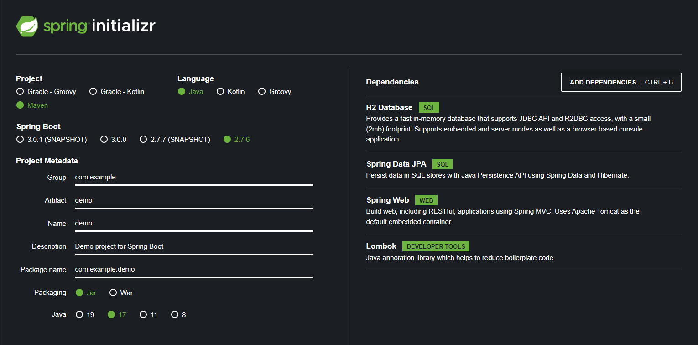
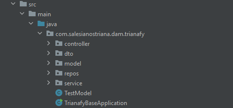
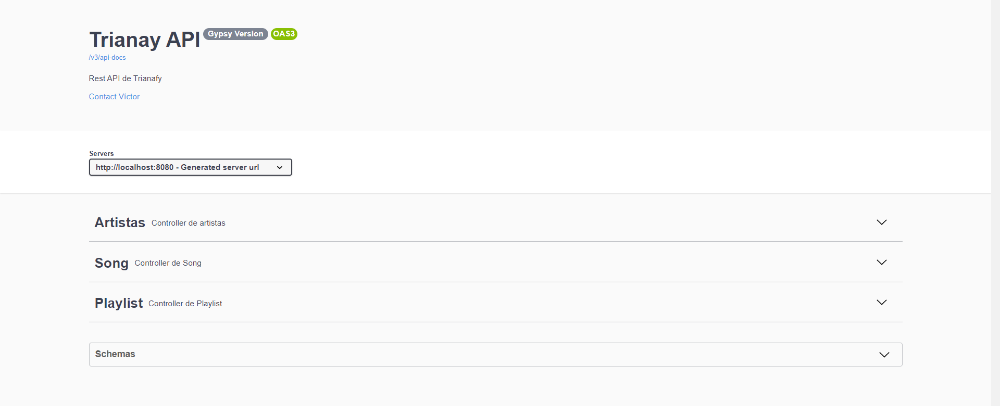
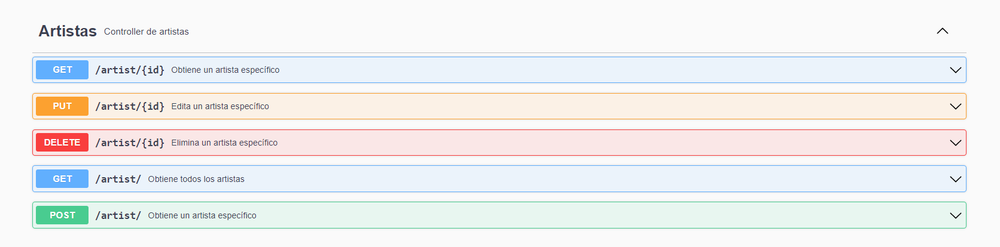
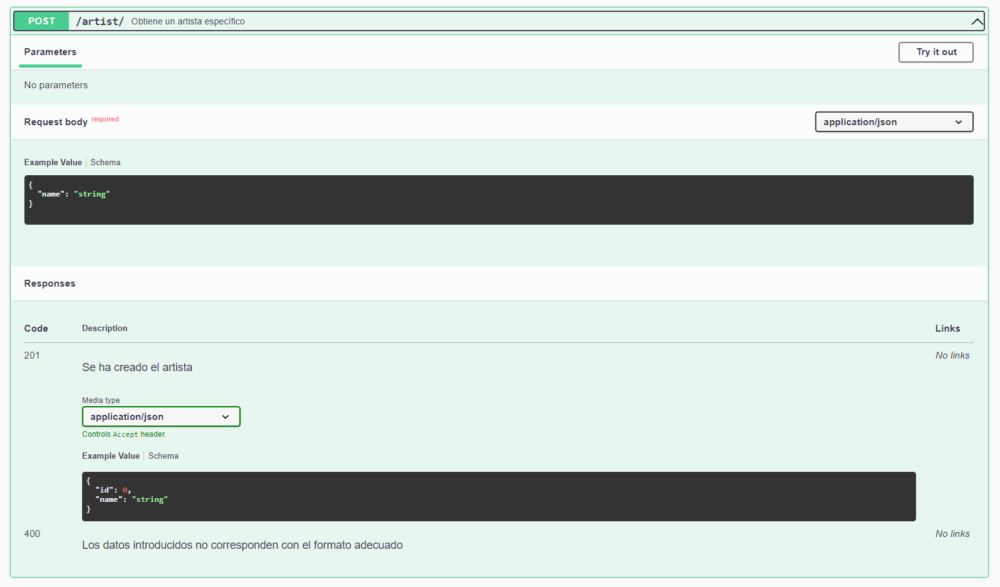
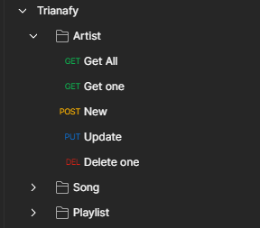

# ProyectoTrianafy

### Como crearlo

Trianafy es una API Rest creada a partir de Jdk 17.0.5, spring-boot 2.7.5,
Apache Maven 3.8.6.

Para el desarrollo de esta API, en primera instancia, generamos un proyecto
en la siguiente página web: https://start.spring.io/. Dicho proyecto Maven
será en lenguage Java, spring-boot 2.7.5, packaging Jar y Java 17. A parte,
las depencias son las siguientes Base de datos H2 Database, Spring Data JPA,
Spring Web y Lombok, tal y como se muestra en la imagen.

### Empezamos la API

A partir de un proyecto base, que podemos obtener a partir de la siguiente url
a github: https://github.com/lmlopezmagana/trianafy-base. Este proyecto incluía
la clase modelo, el servicio y los repo de cada una de las enridandes con las
que ibamos a trabajar (Artist, Song, Playlist). Dado este punto de partida, nos
queda crear los controllers y los dto.

### Controllers

En los tres controllers que tenía que crear, implemente los siguientes endpoints:
Get All, Get One by Id, Create a New One, Edit One by Id, Delete One by Id. Pero
el controller de playlist implementaba los siguientes endpoints: Add One Song
to playlist, Get All songs from playlist, Get One Song from One Playlist y por
último Delete One Song from One Playlist.

### Documentación

Para la implementación del swagger en el proyecto debemos seguir los pasos que encontramos
en la siguiente página: https://www.baeldung.com/spring-rest-openapi-documentation

En esta página encontraremos la dependencia que tenemos que implementar junto con los
plugins que tenemos que actualizar y añadir.

La documentación de la API la podemos encontrar en la página: http://localhost:8080/swagger-ui/index.html
En esta página encontraremos los tres controller y los Schemas de los model y los
Dto que hemos necesitado crear.

Dentro de cada controller se encuentran los diferentes endopoints.

A su vez, dentro de cada endpoint encontramos las diferentes stados de respuesta junto
con el cuerpo que devolvera el servidor en cada caso.

### PostMan

Para probar los endpoints, postman permite importar una colección. Para hacer pruebas de
este proyecto podemos importar la colección ./Trinafy.postman_collection.json

Dentro de la colección hay tres carpetas haciendo referencia a los controladores para que
sea más clara su organización.

